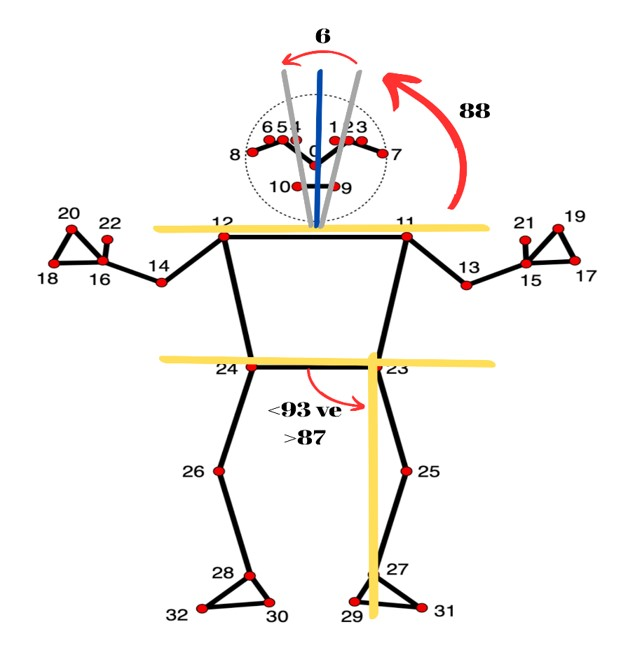

## 🧍‍♂️ Real Time Posture Detection 
## 📌 About the Project

This project is a real-time posture detection system designed to analyze human standing posture and provide instant feedback. Using MediaPipe for pose estimation, the system detects key body landmarks and calculates critical angles to determine whether the user's posture is "Good" or "Bad."

The project focuses on two main angles:

- Head Angle: Between the head and shoulders
- Leg Angle: Between the hip and ankle

---

## 📖 Introduction

With the rise of technology, digital solutions for health monitoring are becoming more accessible and efficient. Poor posture, especially among individuals working long hours at desks, can lead to musculoskeletal disorders over time. Early detection and correction of these postural problems are crucial for long-term health.

This project leverages computer vision and human pose estimation to provide a low-cost, real-time solution for monitoring posture. Using the MediaPipe Pose library, the system identifies key body landmarks (shoulders, hips, nose, ankles) and calculates angles to assess whether the posture is correct.

The detected posture is classified as:

Good Posture – angles within predefined thresholds
Bad Posture – angles outside the thresholds

This system can serve as an effective tool for:

Office workers
Students and young adults
Individuals spending long hours in front of screens

---

## ⚙️ Installation & Setup

Clone the repository:
```bash
git clone https://github.com/OmerFarukArpa/real-time-posture-detection.git
```
```bash
cd real-time-posture-detection
```
(Optional but recommended) Create and activate a virtual environment:
```bash
python -m venv venv
# Linux / macOS:
source venv/bin/activate  
# Windows:
venv\Scripts\activate
```
Install required dependencies:
```bash
pip install opencv-python mediapipe numpy
```
Run the script:
```bash
python detection/posture_detection.py
```
(Adjust the path if your main script has a different filename.)

---

## 📊 How It Works
1. Pose Detection

MediaPipe Pose identifies 33 keypoints on the human body.
Important points for this project:
- Shoulders (left & right)
- Hips (left & right)
- Ankles (left & right)
- Nose (head reference)

2. Angle Calculation

Head Angle: Measures alignment of the head with the shoulders.
Calculated using the midpoint of the shoulders and the nose.
- Threshold: 88° < head_angle < 94°

Leg Angle: Measures alignment of the legs with the hip.
Calculated using hip midpoint and ankle points. 
- Threshold: 87° < leg_angle < 93°

3. Posture Evaluation

- If both angles fall within thresholds → Good Posture
- Otherwise → Bad Posture

4. Visualization

Points and lines are drawn over the video feed to indicate key landmarks and calculated angles.
Text labels display the angles and posture status in real-time.

---

## 🖼️ Project Visuals

<p float="left">
  
</p>

---

## 🛠️ Features

Real-time detection of human body keypoints using MediaPipe Pose

Calculation of head and leg angles for posture evaluation

Visual feedback with color-coded status:
- Green: Good Posture
- Red: Bad Posture

Overlay of lines and points showing the calculated angles
Works on a webcam for interactive monitoring

---
